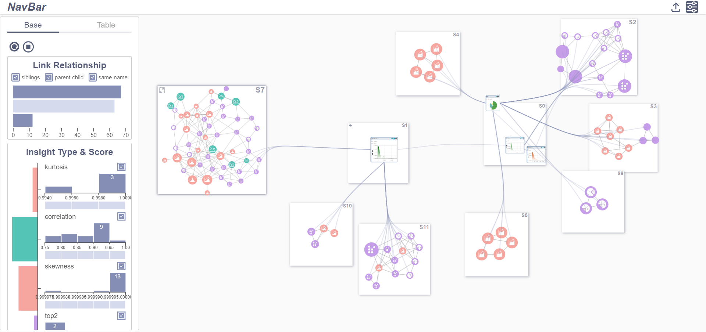
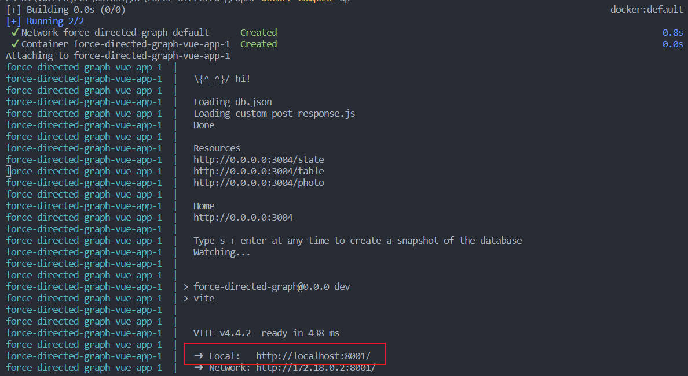

# CoInsight: Visual Storytelling for Hierarchical Tables

[](https://doi.org/10.1109/TVCG.2024.3388553)
[](https://github.com/user-attachments/assets/d68b0283-633a-4898-af4c-e15eab40c844)
[](https://hub.docker.com/r/aaapfcs/insight-graph/tags)

> A visual analytics system that extracts data insights from hierarchical tables and connects them into coherent data stories.



https://github.com/user-attachments/assets/d68b0283-633a-4898-af4c-e15eab40c844

## Overview

**CoInsight** helps analysts discover and organize data insights from hierarchical tables. Unlike flat tables, hierarchical tables have structured headers (like regions → countries → cities). CoInsight leverages these relationships to:

- Extract meaningful patterns automatically
- Build connections between related insights
- Guide users in creating visual data stories

## Key Features

- **Insight Extraction**: Detects 8 types of patterns (outliers, trends, correlations, etc.)
- **Relation Construction**: Connects insights through parent-child, sibling, and same-name relationships
- **Interactive Graph View**: Nested graph layout with edge bundling for exploring insight networks
- **Story Generation**: Organizes selected insights into tree-structured narratives

## Comparison with Industry Tools

We evaluated CoInsight against **AWS QuickSight** and **Microsoft Power BI QuickInsight** — two widely-used commercial insight tools.

### Experiment Setup

- 12 participants explored a game console sales dataset
- 20-minute time limit per tool
- 10 visualization experts rated story quality

### Results

| Metric             | Power BI | QuickSight | CoInsight |
| ------------------ | -------- | ---------- | --------- |
| Stories Created    | ~1.0     | ~0.8       | **~3.0**  |
| Insights per Story | ~2.5     | ~2.0       | **~5.5**  |
| Total Insights     | ~4.0     | ~3.0       | **~12.0** |

**Quality Ratings (0-5 scale):**

| Dimension       | Power BI | QuickSight | CoInsight |
| --------------- | -------- | ---------- | --------- |
| Interestingness | 2.0      | 1.8        | **3.8**   |
| Logicality      | 1.5      | 1.2        | **3.5**   |

> CoInsight enables users to discover **3× more stories** with **2× higher quality** compared to commercial tools.

## Tech Stack

- **Frontend**: D3.js (force-directed graph), Vega-Lite (chart specs), Vue.js
- **Backend**: Flask, Python
- **Analysis**: SciPy (statistical pattern extraction)
- **Deployment**: Docker

## Getting Started

### Using Docker (Recommended)

**1. Install Docker Desktop**

- [Official Guide](https://docs.docker.com/get-docker/)

**2. Pull the image**

```bash
docker pull aaapfcs/insight-graph:0.1
```

**3. Run the container**

```bash
# Download docker-compose.yml from this repo, then:
docker-compose up
```

**4. Open in browser**

```
http://localhost:8001
```



## Publication

```bibtex
@article{li2024coinsight,
  title={CoInsight: Visual Storytelling for Hierarchical Tables with Connected Insights},
  author={Li, Guozheng and Li, Runfei and Feng, Yunshan and Zhang, Yu and Luo, Yuyu and Liu, Chi Harold},
  journal={IEEE Transactions on Visualization and Computer Graphics},
  year={2024},
  doi={10.1109/TVCG.2024.3388553}
}
```

**Paper**: [IEEE Xplore](https://doi.org/10.1109/TVCG.2024.3388553)


## Contact

**Yunshan Feng**  
📧 yunshan_feng@outlook.com  
🔗 [LinkedIn](https://linkedin.com/in/yunshanf) | [GitHub](https://github.com/PFCS33)
